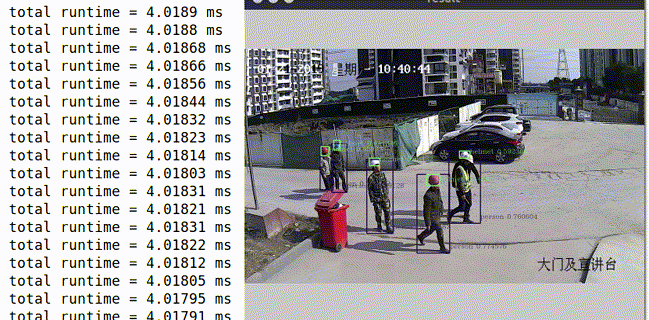
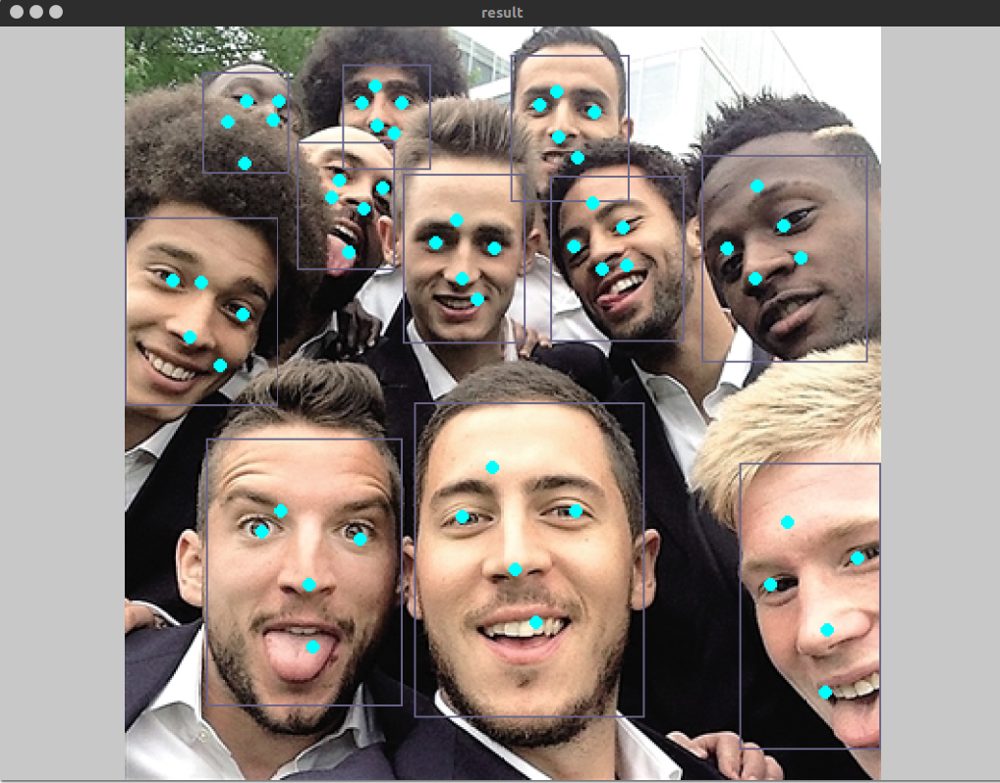

# TensorRT-CenterNet
### demo (GT 1070)
* 
* 

### Performance
| backbone       | input_size | GPU      | mode   | inference Time |
|----------------|------------|----------|--------|---------------|
| mobilenetv2    | 512x512    | gtx 1070 |float32 |    3.798ms    |
| mobilenetv2    | 512x512    | jetson TX2|float16 |    22ms      | 

### Enviroments
1. gtx 1070
```
ubuntu 1604
TensorRT 5.0
```
2. jetson TX2
```
jetpack 4.2
```
### Models
1. Convert [CenterNet](https://github.com/xingyizhou/centernet) model to onnx (deform conv is not support)
2. Use [netron](https://github.com/lutzroeder/netron) to observe whether the output of the converted onnx model is (hm, reg, wh)

### Example
```bash
git clone https://github.com/CaoWGG/TensorRT-CenterNet.git
cd TensorRT-CenterNet
mkdir build
cd build && cmake .. && make
cd ..
##cthelmet
./buildEngine -i model/ctdet_helmet.onnx -o model/ctdet_helmet.engine
./runDet -i model/ctdet_helmet.engine -img test.jpg -cap test.h264
##centerface
./buildEngine -i model/centerface.onnx -o model/centerface.engine
./runDet -i model/centerface.engine -img test.jpg -cap test.h264
```

### Related projects
* [TensorRT-Yolov3](https://github.com/lewes6369/TensorRT-Yolov3)
* [CenterNet](https://github.com/xingyizhou/centernet)
* [centerface](https://github.com/Star-Clouds/centerface)
* [netron](https://github.com/lutzroeder/netron)
* [cpp-optparse](https://github.com/weisslj/cpp-optparse)
