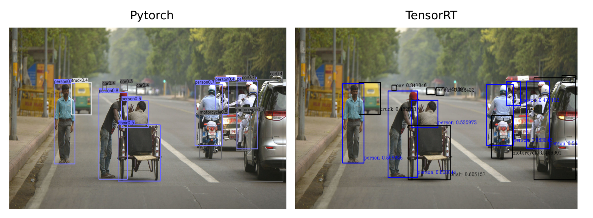
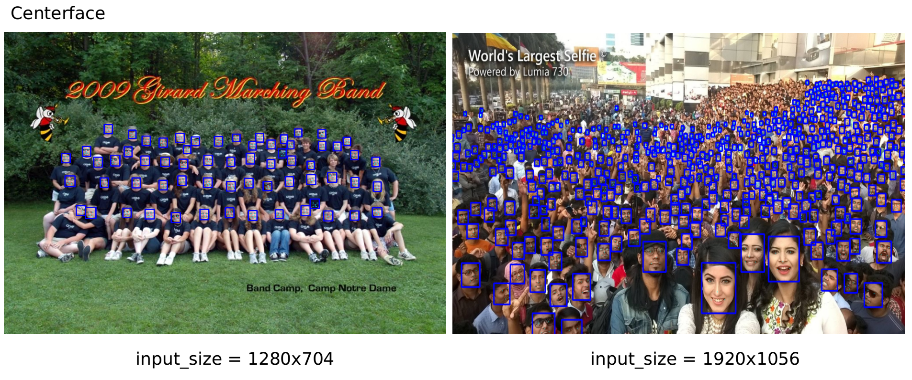

# TensorRT-CenterNet
### demo (GT 1070)
* [ctdet_coco_dla_2x](https://github.com/xingyizhou/CenterNet/blob/master/readme/MODEL_ZOO.md)
    * 
* [centerface](https://github.com/Star-Clouds/centerface)
    * 
* cthelmet
    * 

### Performance
| model       | input_size | GPU      | mode   | inference Time |
|----------------|------------|----------|--------|---------------|
| [mobilenetv2](https://github.com/CaoWGG/Mobilenetv2-CenterNet)    | 512x512    | gtx 1070 |float32 |    3.798ms    |
| [mobilenetv2](https://github.com/CaoWGG/Mobilenetv2-CenterNet)    | 512x512    | gtx 1070 |int8    |    1.75ms    |
| [mobilenetv2](https://github.com/CaoWGG/Mobilenetv2-CenterNet)   | 512x512    | jetson TX2|float16 |    22ms      |
| [dla34](https://github.com/xingyizhou/CenterNet/blob/master/src/lib/models/networks/pose_dla_dcn.py)| 512x512    | gtx 1070 |float32 |    24ms    |
| [dla34](https://github.com/xingyizhou/CenterNet/blob/master/src/lib/models/networks/pose_dla_dcn.py)| 512x512    | gtx 1070 |int8    |    19.6ms    |
| [dla34v0](https://github.com/xingyizhou/CenterNet/blob/master/src/lib/models/networks/dlav0.py)| 512x512    | gtx 1070 |float32    |    12.6ms    |
| [resdcn101](https://github.com/xingyizhou/CenterNet/blob/master/src/lib/models/networks/resnet_dcn.py)| 512x512    | gtx 1070 |float32    |    20.9ms    |
| [resdcn18](https://github.com/xingyizhou/CenterNet/blob/master/src/lib/models/networks/resnet_dcn.py)| 512x512    | gtx 1070 |float32    |    5.81ms    |
| [resdcn18](https://github.com/xingyizhou/CenterNet/blob/master/src/lib/models/networks/resnet_dcn.py)| 512x512    | gtx 1070 |int8    |    3.63ms    |
1. support Deform Conv v2.  
2. no nms.
3. support fp32 fp16 int8 mode.

### Eval Result

|model|GPU|mode|AP<sub>trt</sub>/AP<sub>paper</sub>|AP<sub>50</sub>|AP<sub>75</sub>|AP<sub>S</sub>|AP<sub>M</sub>|AP<sub>L</sub>|
|---|---|---|---|---|---|---|---|---|
|ctdet_coco_dla_2x|gtx 1070|float32|0.365/0.374|0.543|0.390|0.164|0.398|0.536|
|ctdet_coco_dlav0_1x|gtx 1070|float32|0.324/--|0.511|0.343|0.140|0.350|0.476|
|ctdet_coco_resdcn101|gtx 1070|float32|0.332/0.346|0.516|0.349|0.115|0.367|0.531|
|ctdet_coco_resdcn18|gtx 1070|float32|0.277/0.281|0.448|0.286|0.083|0.290|0.454|
|ctdet_coco_resdcn18|gtx 1070|int8|0.238/0.281|0.394|0.246|0.062|0.254|0.402|

#### notes
 * I show test AP with no augmentation.
 * input_szie = 512x512
 * thresh = 0.01
 * maxpool kernel_size = 3
 * calib_img_list.txt : random sample 700 images from COCO2017/val2017

### Enviroments
1. gtx 1070
```
ubuntu 1604
TensorRT 5.0
onnx-tensorrt v5.0
```
2. jetson TX2
```
jetpack 4.2
```

### Models
1. Convert [CenterNet](https://github.com/xingyizhou/centernet) model to onnx. See [here](readme/ctdet2onnx.md) for details.
2. Use [netron](https://github.com/lutzroeder/netron) to observe whether the output of the converted onnx model is (hm, reg, wh)

### Example
```bash
git clone https://github.com/CaoWGG/TensorRT-CenterNet.git
cd TensorRT-CenterNet
mkdir build
cd build && cmake .. && make
cd ..

##ctdet | config include/ctdetConfig.h 
## int 8
./buildEngine -i model/ctdet_coco_dla_2x.onnx -o model/ctdet_coco_dla_2x.engine -m 2 -c calib_img_list.txt
./runDet -e model/ctdet_coco_dla_2x.engine -i test.jpg -c test.h264

##cthelmet   | config include/ctdetConfig.h
## flaot32
./buildEngine -i model/ctdet_helmet.onnx -o model/ctdet_helmet.engine -m 0
./runDet -e model/ctdet_helmet.engine -i test.jpg -c test.h264
## int8
./buildEngine -i model/ctdet_helmet.onnx -o model/ctdet_helmet.engine -m 2 -c calib_img_list.txt
./runDet -e model/ctdet_helmet.engine -i test.jpg -c test.h264

##centerface | config include/ctdetConfig.h 
./buildEngine -i model/centerface.onnx -o model/centerface.engine
./runDet -e model/centerface.engine -i test.jpg -c test.h264

## run eval_coco.py | conifg your cocodaset and ctdet_coco engine 
python3 eval_coco.py
```

### Related projects
* [TensorRT-Yolov3](https://github.com/lewes6369/TensorRT-Yolov3)
* [onnx-tensorrt](https://github.com/onnx/onnx-tensorrt)
* [TensorRT](https://github.com/NVIDIA/TensorRT)
* [CenterNet](https://github.com/xingyizhou/centernet)
* [centerface](https://github.com/Star-Clouds/centerface)
* [netron](https://github.com/lutzroeder/netron)
* [cpp-optparse](https://github.com/weisslj/cpp-optparse)

